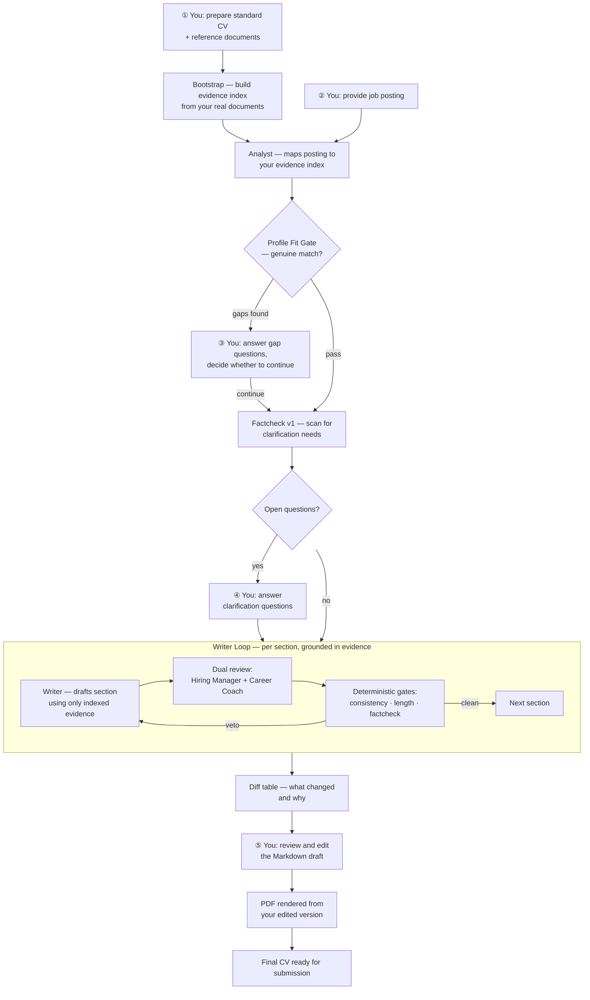

# Agentic CV Tailoring

A pipeline that helps present documented, verifiable experience in the most
relevant framing for a specific role — without adding, inventing, or
embellishing anything.

> **For anyone reading this while reviewing an application:** every claim in
> any CV produced with this system is grounded in pre-indexed source
> documents (employer references, certificates, work samples). The pipeline
> is designed to be incapable of inventing experience. See
> [Factual fidelity](#factual-fidelity--what-the-pipeline-cannot-do) below.

---

## The problem this solves

A strong candidate has years of varied, documented experience. Any given job
posting activates a different subset of that experience. Manually rewriting a
CV for every application — in a consistent voice, at the right level of
specificity, without accidentally drifting away from what is actually
documented — is time-consuming and error-prone.

This pipeline automates the *presentation* layer: which experiences to
emphasise, how to frame them for the role, how to maintain consistent
phrasing. It does not automate the *substance* layer — the underlying
experience, proof documents, and strategic decisions remain entirely the
candidate's own work.

---

## Factual fidelity — what the pipeline cannot do

Before any CV section is written, a bootstrap phase indexes all source
documents into an evidence store:

```
data/standard_cv.md          ← comprehensive base CV, authored by hand
data/zeugnisse/               ← employer references, certificates, PDFs
data/beleg_index.json         ← generated evidence index (one entry per claim,
                                 each with: text snippet, source file, position)
```

Every claim the Writer agent produces is checked against this index by a
dedicated Factcheck agent. Claims that cannot be traced to a source document
trigger a veto and block the output. The pipeline is structurally incapable
of inserting experience that is not already in the indexed source documents.

---

## What you must bring — the human investment

The pipeline is only as good as what goes into it. Running it requires
substantial preparation that cannot be automated:

**1. A comprehensive, honest standard CV**
The base CV must document all relevant experience in full: concrete
achievements, specific numbers, team sizes, technologies, timelines. Vague
entries produce vague output. The standard CV is not a job-application
document — it is a complete record. Preparing it is significant work.

**2. Supporting reference documents**
Employer references (Arbeitszeugnisse), certificates, and other proof
documents are indexed at bootstrap time. The more complete this document
set, the more evidence is available for the factcheck layer to verify claims
against.

**3. Answers to clarification questions**
After the Analyst reviews the job posting, it may pause the pipeline to ask
specific questions: "The posting mentions X — can you confirm whether this
applies to your experience at Y?" These require explicit written answers
before the pipeline continues. There is no shortcut around this step.

**4. A profile-fit decision**
If the Analyst identifies a genuine mismatch between the posting's
requirements and the documented experience, the pipeline first turns the
gaps into clarification questions — documented evidence is a lossy
compression of a career, and many "gaps" are answerable. Whatever remains
unanswered stays in a structured gap report, and the pipeline asks whether
to continue. This gate exists to
prevent the pipeline from producing a CV that overstretches the candidate's
documented profile. The decision to continue or stop is the candidate's.

**5. A review pass**
The output is a starting point for the final version, not a finished
document. The candidate reviews the result, edits the Markdown directly,
and the PDF is regenerated from the edited version. The pipeline produces a
draft; the candidate owns the submission.

---

## What the pipeline actually does

Given the source documents, the job posting, and the candidate's answers to
any clarification questions, the pipeline:

1. Analyses the posting and maps it against the evidence index
2. Checks that the candidate's profile is a credible match (or surfaces gaps)
3. Drafts each CV section (Management Summary → Key Competencies →
   Work History), grounded strictly in the indexed evidence
4. Has two independent reviewers critique each draft (one simulating a
   Hiring Manager perspective, one a career coach perspective)
5. Checks every draft for factual drift, verbatim header consistency, bullet
   length, and summary word count — and rewrites if any check fails
6. Scans the assembled CV for verbatim repetition between sections and
   reports it for human review (no silent rewrite)
6. Produces a diff table showing every change from the base CV with a
   one-line reason
7. Optionally translates the result if the posting is in English

At no step does the pipeline introduce claims that aren't in the source
documents. The output is a *selection and phrasing* of existing evidence,
not a generation of new content.

---

## Process — human touchpoints highlighted



---

## Engineering notes

For readers interested in the implementation:

- **Multi-agent orchestration via LiteLLM.** Eight specialised agents
  (Analyst, Writer, Hiring Manager Reviewer, Coach Reviewer, Factcheck,
  Diff, Keyword Marker, Translator) are routed through LiteLLM, which
  abstracts provider differences behind a uniform API. Switching a model
  is a one-line change in `config.yaml` — no code changes.

- **Cross-provider review as anti-confirmation-bias.** The Hiring Manager
  Reviewer and Translator run on OpenAI (`gpt-4.1`, `gpt-4.1-mini`);
  Analyst, Writer, Coach, Factcheck, and Diff run on Anthropic
  (`claude-opus-4-7`, `claude-sonnet-4-6`, `claude-haiku-4-5`). One
  provider cannot echo the other into agreement.

- **Prompt caching for cost efficiency.** Static context per agent call
  (standard CV, evidence index, style exemplars, analysis output) is sent
  as an Anthropic `cache_control: ephemeral` prefix. The dynamic part
  (current section draft, reviewer feedback) is the uncached suffix.
  Achieves ~50–75% token cost reduction after cache warmup.

- **Parallel reviewers with threading locks.** Hiring Manager Reviewer and
  Coach Reviewer run concurrently in a `ThreadPoolExecutor`. Shared
  mutable state (JSONL log files, run-log appends, clarification store) is
  protected by per-resource threading locks with atomic `tmp + os.replace`
  writes.

- **Deterministic quality gates — no LLM judgement for structural rules.**
  Profile-fit check, consistency check (verbatim job-history headers),
  length check (22-word bullets, 120–160-word summaries, max 6 competency
  entries), cross-section redundancy check (shared 8-word n-grams between
  Summary and other sections, report-only), and factcheck parse structured
  validator results. LLM reviewer signals only trigger a
  rewrite round if a named veto marker is present in the output — generic
  "could be improved" commentary is advisory, not blocking.

- **Topic-gated clarification memory against cross-claim fusion.** Saved
  answers are persisted with a 12-topic keyword taxonomy (e.g. `ml_ai`,
  `domain_health`, `subscription_saas`) and replayed into prompts only
  when the current posting activates the same topics. Prevents a
  healthcare-specific answer from leaking into an unrelated role's framing.

- **Demonstration-based style transfer.** Two manually-polished CV
  examples sit as a `cache_control: ephemeral` prefix in the Writer's
  context. Style is transferred by example, not by prose rules. A
  self-match filter prevents an exemplar from being used as a reference
  for the very role it was written for.

- **Eval suite for regression testing across runs.** `evals/run.py` runs
  deterministic checks on saved run artefacts: factuality (claim-to-evidence
  traceability), vocabulary coverage, length drift, diff granularity, and
  bold distribution. An optional LLM-as-judge with a skeptical rubric adds
  a qualitative second perspective. Eval cases are versioned YAML files in
  `evals/cases/`; `cv-tailor quality-trend` surfaces regressions by
  comparing the latest run snapshot against the trailing-5 median across
  metrics like writer-round-2 count, factcheck veto rate, cache hit rate,
  and cliché density (substring-matched against a curated word list;
  structural section-header terms are explicitly excluded to keep the
  baseline stable across roles).

- **Observability.** Every LLM call is logged to `logs/YYYY-MM/llm_calls.jsonl`
  with timestamp, agent, provider, model, phase, token counts (including
  `cache_read_input_tokens`), cost, duration, and status. Errors land in a
  separate `errors.jsonl` with stack traces. The web UI exposes a per-run
  cost breakdown and cache hit rate in real time.

- **Prompts as versioned code.** All agent prompts live in `prompts/*.md`,
  tracked in git. Prompt changes are visible as diffs; regressions can be
  bisected by commit. A `CV_TAILOR_DEV_RELOAD=1` flag hot-reloads prompt
  files on each call without restarting the server, enabling rapid
  iteration in the web UI.

- **Test suite — deterministic layer.** 100+ pytest tests cover language
  detection, topic classifier, consistency checker, length checker, cost
  tracking, factcheck parser, keyword marker, PDF helpers, profile-fit
  parser, prompt-cache layout, and quality snapshot. One documented
  `xfail` pins a known validator gap for future work.

Full architecture decisions are documented in [`ARCHITECTURE.md`](./ARCHITECTURE.md).

---

## Running the demo

The repo ships with a fictional demo persona ("Alex Müller") so the pipeline
can be run end-to-end without any real personal data.

```bash
uv sync
python scripts/init_persona.py --overwrite-real   # generate demo CV files
cp .env.example .env                              # add API keys
uv run cv-tailor bootstrap                        # build evidence index
uv run cv-tailor run stellenanzeigen/demo/posting_de.md
```

If a run stops mid-pipeline (e.g. a model call fails after the Writer loop
has completed), resume the post-processing steps without re-running the
Writer:

```bash
uv run cv-tailor post-process <run_id>   # diff → keyword marker → translator → PDF
```

> **Note:** `CV_TAILOR_SKIP_PDF=1` skips PDF rendering (requires a custom
> HTML template not included in this repo).

---

## Repository layout

```
src/cv_tailor/         — Python source (orchestrator + 8 agents)
prompts/               — Versioned Markdown prompts per agent
data/                  — Persona, demo CV, evidence inputs, demo template
stellenanzeigen/demo/  — Demo job postings (DE + EN)
evals/                 — Eval cases + deterministic quality runner
tests/                 — Pytest suite for the deterministic layer (100+ tests)
```

---

## License

MIT. Personal data shown in this repo is fictional. "Alex Müller" is not a
real person; the demo employers are not real companies.
